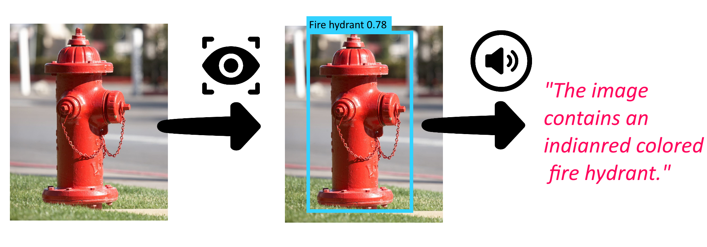

# Img2Voice

This code allows to translate an image into an audio translation of the image content and their respective colors.

The script can load any pre-trained model from the [TensorFlow 2 Detection Model Zoo](https://github.com/tensorflow/models/blob/master/research/object_detection/g3doc/tf2_detection_zoo.md) to apply object detection to the input image. The detected objects and their location are then translated into a text representation for which the dominant color is predicted for each detected object. Lastly, the image text representation is read back to the user. 

## Setup

1. Install the necessary dependancies listed in `requirments.txt`. It's advised to use anaconda or any other virtual environment managmer for this. 

e.g Anaconda run `conda create --name <env> --file <this file>`

2. Adapt the parameters such as image object detecetion model at the bottom of `main.py`.

3. Place input images into `./images`

4. Run `main.py` with the setup environment

The model will automatically:

- setup a workspace with the specified name in the cwd
- download the specified model and its configuration file
- ask for the input image file during runtime via terminal input. Multiple images can be run in sequence without restarting the model

## Credit

The script leverages many different existing libraries and resources which I want to pay credit here.

The object detection part is based on code snippets from [Tensorflow 2's object detection API tutorial](https://tensorflow-object-detection-api-tutorial.readthedocs.io/en/latest/auto_examples/object_detection_camera.html). 

For the dominant color prediction the library [webcolors](https://pypi.org/project/webcolors/) was used. To handle None returns of webcolor's rgb_to_name() a code snipped [Stackoverflow](https://stackoverflow.com/questions/9694165/convert-rgb-color-to-english-color-name-like-green-with-python) with credits to [fraxel](https://stackoverflow.com/users/1175101/fraxel).

Fire hydrant image [credit](https://waterstreet.blog/2019/07/15/hidden-hydrant-dangers/)